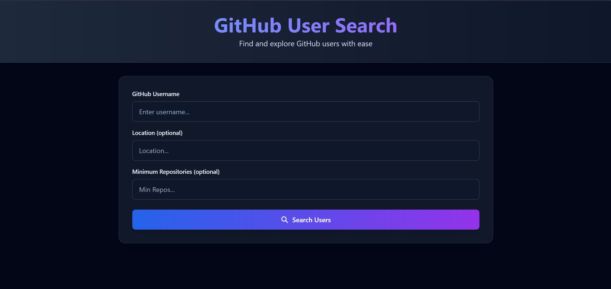

<div align="center">
<h1 align="center">🔍 GitHub User Search</h1>


A responsive web application built with **React** and **Tailwind CSS** that allows users to search for GitHub profiles and view their details using the GitHub API.

<a href="https://github-user-search-project-ten.vercel.app/"><strong>➥ Live Demo</strong></a>

</div>

<br />

### Demo Screeshot



---

## ✨ Features

- **Search Functionality:** Real-time search for any GitHub user.
- **User Details:** Displays avatar, name, bio, follower counts, following counts, and public repositories.
- **Responsive Design:** Fully optimized for desktop, tablet, and mobile devices using Tailwind CSS.
- **API Integration:** Fetches data asynchronously using **Axios**.
- **Error Handling:** Displays friendly error messages if a user does not exist.

## 🛠️ Tech Stack

- **Frontend:** [React.js](https://reactjs.org/)
- **Styling:** [Tailwind CSS](https://tailwindcss.com/)
- **HTTP Client:** [Axios](https://axios-http.com/)
- **API:** [GitHub REST API](https://docs.github.com/en/rest)
- **Deployment:** [Vercel](https://vercel.com/)

## 📂 Sections Included

1.  **Hero:** Introduction with Call-to-Action (CV/Contact).
2.  **About Me:** Personal bio section.
3.  **Tech Stack:** Grid layout of skills and technologies.
4.  **Projects:** Card-based grid with hover effects and links to GitHub/Live demos.
5.  **Experience & Education:** Vertical timeline or list view.
6.  **Contact:** Static contact form and social links.

---

## 🚀 Getting Started

Follow these steps to run the project locally on your machine.

### Prerequisites

- Node.js
- npm or yarn

### Installation

1.  **Clone the repository:**

    ```bash
    git clone https://github.com/Amine4jh/github-user-search.git
    cd github-user-search
    ```

2.  **Install dependencies:**

    ```bash
    npm install
    # or
    yarn install
    ```

3.  **Run the development server:**

    ```bash
    npm run dev
    # or
    yarn dev
    ```

4.  Open [http://localhost:5173](http://localhost:5173) with your browser to see the result.

---

## ⚙️ Configuration

1.  Create a `.env` file in the root directory.
2.  Add your GitHub Token:
    ```env
    VITE_APP_GITHUB_API_KEY=your_token_here
    ```

---

## 👤 Author

**Amine Ajaha**

GitHub: @Amine4jh

LinkedIn: [Amine Ajaha](https://www.linkedin.com/in/amineajaha/)

---

## 📄 License

This project is open source and available under the MIT License.
